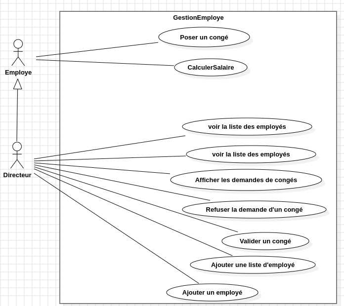
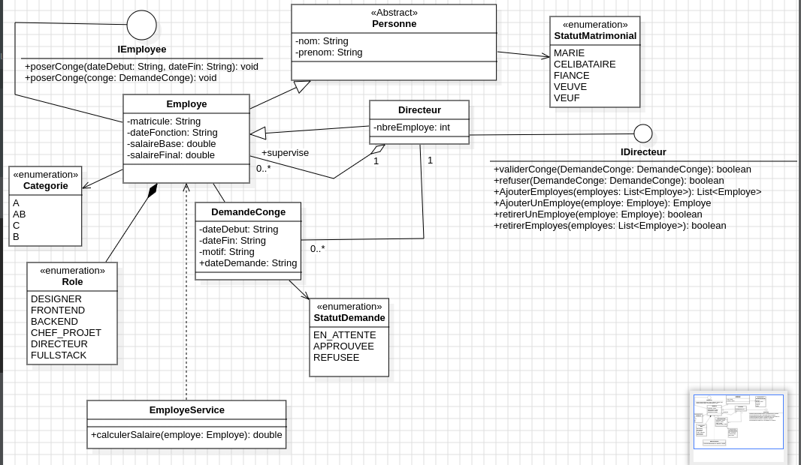

# Application de gestion des employés d'une entreprise
- Un employé est caractérisé par un nom, un prénom et son statut matrimoniale
- Un directeur est caractérisé par un nom, un prénom et un nombre d'employé
- Un employé peut poser des congés. Il fournit une date de début et une date de fin
- Sa demande est soumise au directeur. Le directeur peut valider la demande de congé de l'employé
- Un directeur peut aussi poser des congés.Sa demande de congé est automatiquement validée
- Un directeur peut aussi refuter la demande de congé d'un employé
- Tout employé doit avoir un matricule, une date où il commencer à travailler dans l'entreprise, un role ainsi qu'un salaire
- Chaque employé à une categorie et son salaire est calculé selon sa catégorie
- Les employés qui ont une longevité de plus de 3 ans sont de categorie B et à leurs salaires on ajoute 8%
- Les employés qui ont une longevité de plus de 1 an mais moins de 3 ans sont de categorie AB et à leurs salaires on ajoute 2%
- Les employés qui ont une longevité de plus de 6 ans sont de categorie C et à leurs salaires on ajoute 15%
- A correspond à la catégorie d'un nouvel employé
- le salaire de base d'un directeur est est de 1.2M, s'il est marié on lui ajoute une prime qui est de 270.700 fcfa
- la devise utilisé est le fcfa
- le salaire de base d'un employé est de 450.000 fcfa s'il est un dev frontend
- le salaire de base d'un employé est de 455.500 fcfa s'il est un designer
- le salaire de base d'un employé est de 500.000 fcfa s'il est un dev backend
- le salaire de base d'un employé est de 720.000 fcfa s'il est un dev fullstack
- le salaire de base d'un employé est de 815.500 fcfa s'il est un chef de projet
- Un directeur est un employé qui a un ensemble d'employé qu'il gere
- salaire = salaire de base + prime de longevité
- le Statut matrimonial peut etre : Mariaged -> marié, Engaged -> fiancé, Single -> Celibataire, Widow -> veuve, Widower-> veuf

## Ce que nous avions pu faire pour l'instant !

1. Factoriser les classes
2. Créer les interfaces
3. Les implementer

### Use Case diagram

### Class Diagram

